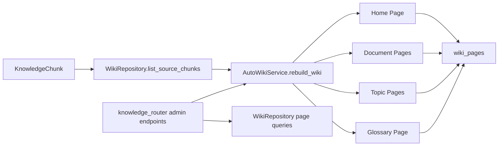

# Phase 4 Auto-Wiki Design

Updated: 2026-06-03

## Architecture

Phase 4 adds an extractive Auto-Wiki layer on top of Phase 3 evidence-bound chunks.

## Data Contract

New table: `wiki_pages`.

Required page fields:

- `page_id`
- `db_id`
- `page_type`
- `slug`
- `title`
- `source_id`
- `markdown`
- `backlinks`
- `evidence_ids`
- `freshness`
- `status`
- `metadata`
- `generated_at`
- `updated_at`

Indexes:

- `idx_wiki_pages_db_type`
- `idx_wiki_pages_db_slug`
- `idx_wiki_pages_source`

## Page Generation

Full database rebuild:

1. Load evidence-bound chunks for the database.
2. Remove existing wiki pages for the database.
3. Generate document pages grouped by `file_id`.
4. Extract deterministic topics from chunk text.
5. Generate topic pages and a glossary page.
6. Generate a home page linking to document, topic, and glossary pages.
7. Attach backlinks.
8. Persist all pages.

Local file rebuild:

1. Load chunks for `db_id + file_id`.
2. Remove document pages whose `source_id` equals the file id.
3. Regenerate document pages for that file only.
4. Leave global home, topic, and glossary pages in place.

## Freshness

Every page gets a deterministic freshness payload:

- `status`
- `source_chunk_count`
- `source_doc_version_ids`
- `source_chunk_ids`
- `evidence_count`

This is intentionally not a stale-page detector yet. Phase 5 can compare this payload against newer source chunk/doc-version state.

## API Surface

Admin-only endpoints added to the existing knowledge router:

- `POST /knowledge/databases/{db_id}/wiki/rebuild`
- `GET /knowledge/databases/{db_id}/wiki/pages`
- `GET /knowledge/databases/{db_id}/wiki/pages/{page_id}`

## Risks

- Topic extraction is heuristic and deterministic; it is useful for the Phase 4 skeleton but not a semantic entity model.
- Markdown is extractive; it does not yet perform LLM synthesis or claim-level rewriting.
- Local rebuild intentionally avoids regenerating global pages, so global backlinks can become stale until a full rebuild runs.
