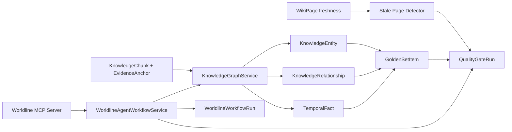

# Phase 5-7 Knowledge Ops Design

Updated: 2026-06-03

## Architecture

## Phase 5

The graph layer is deterministic and local-first.

- Reads from evidence-bound chunks.
- Extracts concept/proper-noun entities.
- Creates `co_mentions` relationships from entities co-occurring in the same chunk.
- Extracts ISO-like dates into `TemporalFact` rows.
- Binds entities, relationships, and temporal facts to `evidence_ids`.
- Detects stale Wiki pages by comparing persisted `WikiPage.freshness` to current chunk/doc-version ids.

## Phase 6

The MCP layer is a controlled tool surface, not a raw database/filesystem bridge.

- `src.mcp.worldline_server` publishes the server entrypoint.
- Manifest tools:
  - `worldline.compile_document`
  - `worldline.rebuild_wiki`
  - `worldline.update_graph`
  - `worldline.run_quality_gate`
  - `worldline.inspect_timeline`
- Write tools require admin.
- External agents do not get direct database writes.
- Workflow plans are LangGraph-shaped DAGs with ARQ dispatch metadata.

## Phase 7

The quality gate is deterministic and replayable.

- Builds golden set items from evidence-bound entities and wiki pages.
- Produces coverage map sections: graph, timeline, wiki, golden set, production.
- Calculates evidence accuracy and checks stale page count.
- Emits failure replay payloads that can rerun the same gate endpoint.
- Records tracing, cost, latency, and permission checks in `quality_gate_runs`.

## Risk Boundaries

- Entity extraction is heuristic and should be replaced or augmented later.
- Relationship extraction is co-mention based and not a semantic relation classifier.
- LangGraph and ARQ are represented as the workflow contract; real external worker execution is a later hardening step.
- Quality gate is a deterministic local gate, not a full CI workflow file yet.
