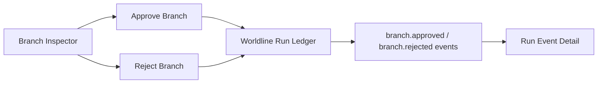

# Branch Decision Replay Design

## Flow

## Frontend Behavior

- Local branch data includes a third `nextActions` entry:
  - `targetType: "reject"`
  - secondary styling
  - copy explaining rollback to planning.
- `handleBranchAction` dispatches `reject` to a new `rejectActiveBranch` helper.
- `rejectActiveBranch` uses:
  - `ensureLedgerRun()`
  - `worldlineRunApi.rejectBranch(runId, branch.id, { reason })`
  - `mergeLedgerResult(...)`
  - `worldlineStore.setHandoff(...)`

## Contract

The backend already returns `latestEvent.eventType = "branch.rejected"` and branch decision metadata. This stage does not alter that contract.

## Risk

Current browser QA may run without admin login or backend availability. In that state the correct behavior is a visible local-preview/admin-needed message, not a fake rejection.
