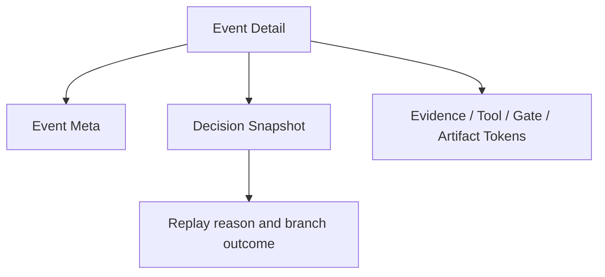

# Decision Snapshot Design

## Data Source

Use `selectedLedgerEvent.summary`, especially fields emitted by `WorldlineRunLedgerService._branch_event_summary`:

- `status`
- `reason`
- `branch_title`
- `branch_type`
- `quality_status`
- `score`

## UI Placement

Decision Snapshot sits below the event meta grid and above linked token sections.

## Degrade Gracefully

Render the section only if at least one branch decision field exists. Non-decision events keep the current layout.

## Styling

Reuse the dark luminous panel language:

- compact grid cards
- gold labels
- cyan text
- red-tinted status only through existing status classes where available
