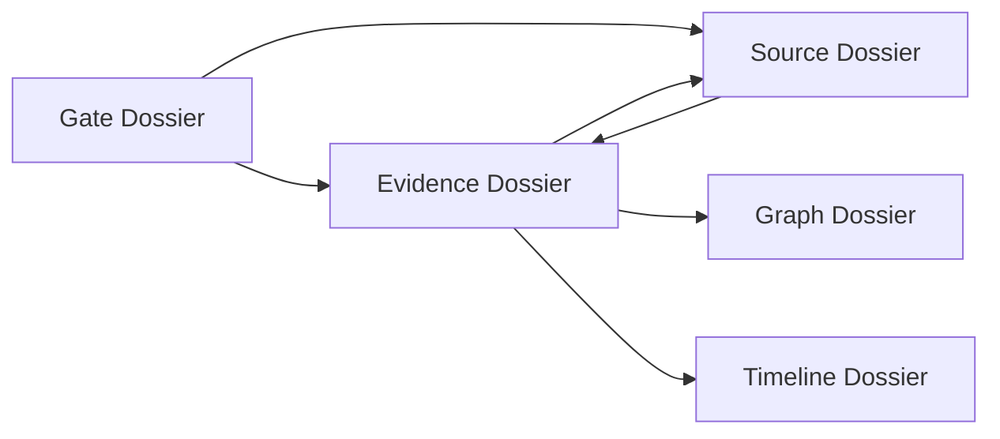

# Worldline Agent Source Dossier Design

## Data Model

Local fallback evidence refs gain an optional `sourceRef` object:

```js
{
  id: 'source-agent-workflow-service',
  kind: 'Python service',
  label: 'WorldlineAgentWorkflowService',
  documentNodeId: 'docnode-agent-workflow-lanes',
  documentNodeLabel: 'Controlled subagent lane manifest',
  role: 'Defines controlled agent lanes and tool scopes.',
  capability: 'research_reviewer, knowledge_operator, frontend_qa, release_auditor'
}
```

This mirrors the backend concept without changing the payload contract. When live backend data eventually includes richer source assets, the Dossier code can read the same source fields and degrade gracefully.

## Focus Flow



## UI Behavior

- Source links use the existing Dossier link button style.
- Source focus does not select the Evidence Rail tab because Source is a file-level detail, not a rail layer.
- Scroll fallback lands on the Dossier when no physical rail target exists.

## Risk

- Static source line ranges can drift if backend files move. The task evidence records that the referenced files currently exist and match the intended ranges.
